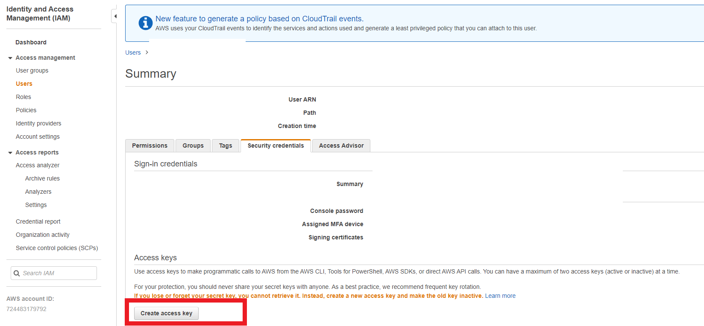

# Amazon S3 postman collection

This collection can be used for downloading files from S3. This can be currently used with any Account with an assumption that the account has an MFA code set up.

In order to use this, there is an one time setup required. As the collection uses a user account, you need to download access and secret key from IAM.

## Initial Setup

### Get Key from AWS
- Log in to AWS account
- Move to IAM
- Go to users
- Search your user
- Open Security Credentials
- Click on Create Access key

### Setup Environment in Postman

The following variables need to be setup in Postman

| Variable Name | Description | Inital Value |
| ------ | ------ | ------- |
| accessKey | Access Key of your AWS account | Value from the file downloaded from IAM |
| secretKey | Secret Key of your AWS account | Value from the file downloaded from IAM |
| session | Session for the API calls | No initial value need to be setup |
| service | Service being used from AWS | sts |
| accountNumber| Account of the user | Number of the account being used |
| email | Email of the user | Email Account eg: user@gmail.com |
| roleAccount | Account of the role that has access to bucket | role account number |
| roleName | Name of the role that has access to bucket | Any name eg: admin, developer etc |
| bucket | S3 bucket name | name of bucket |
| updatedAccessKey | This is being used to update key for session | No initial value setup |
| updatedSecretKey | This is being used to update key for session | No initial value setup |
